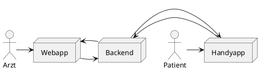

# DGSDoktorUndInformation

## Context


Dieses UML ist ein PlantUML Diagramm. **TODO: Githubintegration**. Auf [Plantuml](https://plantuml.com/de/) kann dieses Diagramm erzeugt werden.

## Backend
Das Backend steuert den State und verwaltet die Kommunikation der Chats

### Technologien
[Java]("https://www.java.com/)

[SpringBoot](https://spring.io/projects/spring-boot)

[Lombok](https://projectlombok.org/)

### Anwendungsstart
```
gradlew bootrun
```

## Webapp
Zugänge für die Webapp werden an Krankenhäuser, Ärzte und andere Pflegeeinrichtungen versendet.

### Technologien
[JavaScript](https://developer.mozilla.org/de/docs/Web/JavaScript)

[vue.js](https://vuejs.org/)

[vuetify](https://vuetifyjs.com/)

[npm](https://www.npmjs.com/)

### Anwendungsstart
```
npm run serve
```

### Verbindung zum Backend
Diese App läuft parallel zur Backendapp auf einer Umgebung

## Handapp
[Dart](https://de.wikipedia.org/wiki/Dart_(Programmiersprache))

[Flutter](https://flutter.dev)

### Anwendungsstart
```
flutter run
```

## Verbindung zum Backend
Config.dart
```dart
static const baseUrl = "http://ipadresse:8080";
```
**Achtung: Auch in Emulatorumgebungen muss die Netzwerk-IP genutzt werden.**

## Deployment und Laufzeitumgebung

TODO
